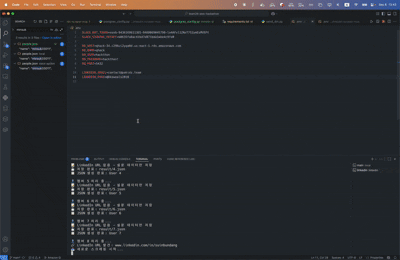

# 일등합시다 : NetWalking

해커톤은 다양한 분야의 사람들이 모여 지식 공유의 기회가 많은 자리이지만, 
그만큼 상호간의 접점이 적어 먼저 대화를 시작하기 어려운 곳이기도 합니다. 

경쟁적인 분위기와 시간, 체력적 압박속에 지친 **Hackathon** 속에서
잠시 속도를 낮춰 걸으며 함께 옆에서 뛰는 다른 팀과의 자연스러운 네트워킹을 도와주는
**NetWalking**을 소개합니다.

## 어플리케이션 개요

NetWaling은 자연스러운 오프라인 소통을 목표로, 참가자들의 사전 정보를 바탕으로 대화 주제를 추천합니다.

이를 위해 먼저 Amazon Q Developer Hackathon의 주요 소통 도구인 Slack 워크플로우를 연동하여, 참가자의 관심 분야, 직군, 취미 활동과 같은 설문 결과 및 LinkedIn 프로필 URL을 수집합니다.

수집된 LinkedIn 프로필은 웹 크롤링을 통해 추가적인 관심사와 배경 정보를 확보하고, 이를 바탕으로 각 참가자에 대한 더 구체적인 관심사를 파악합니다.

이후 서로 다른 팀의 참가자들을 일대일로 매칭하고, 행사장 내 만남 시간을 Slack API를 통해 DM으로 안내합니다. 참가자가 만남을 수락하면, 상대방의 설문 결과와 LinkedIn 기반 관심사 정보를 프롬프트로 LLM에 입력하여 추천 아이스브레이킹 대화 목록을 생성하고, 만남 장소와 함께 참가자에게 전달합니다.

## 주요 기능

어플리케이션의 주요 기능 들을 설명합니다. 가능하다면 각 화면의 캡처를 기반으로 설명 자료를 작성합니다.
### 1. 데이터 수집 및 변환
- 엑셀 파일 처리: 참가자 설문 데이터를 구조화된 JSON 형태로 자동 변환

- 다중 데이터 소스 통합: 설문 응답, LinkedIn 프로필, Slack ID를 하나의 통합 데이터셋으로 결합
  
- 데이터 검증: 유효하지 않은 LinkedIn URL 필터링 및 데이터 무결성 검사

### 2. LinkedIn 프로필 자동 크롤링
- Selenium 기반 웹 스크래핑으로 실시간 데이터 수집

- 포괄적 정보 추출 항목
	- 개인 정보: 이름, 헤드라인, 자기소개
 	- 경력 사항: 직무 경험, 회사 정보
	- 학력 정보: 학교, 전공
	- 기술 스킬 및 전문성

### 3. Slack 커뮤니티 채널을 통한 네트워킹 알림

- **워크스페이스 멤버 수집**
  - `users_list()` API로 전체 멤버 정보 조회
  - `people.json` 파일에 저장

- **팀 구분 로직**
  - `real_name`에서 `_` 구분자로 팀명 추출
  - 같은 팀 여부 판별

- **미팅 페어 생성**
  - PostgreSQL에서 `has_meeting = false` 멤버 조회
  - 서로 다른 팀 멤버끼리 최대 3개 페어 매칭
  - 사용된 멤버는 중복 매칭 방지

- **데이터베이스 저장**
  - `member_meeting` 테이블: 각 멤버별 수락 상태 저장
  - `meeting` 테이블: 페어 정보, 시간, 장소(1~3번) 저장

- **DM 알림 발송**
  - 매칭된 각 멤버에게 개별 DM 전송
  - DM 내용: 미팅 시간, 수락 버튼 링크 포함
  - 버튼 클릭 시 웹 API 엔드포인트로 수락 처리

## 동영상 데모

### LinkedIn 크롤링 데모

위 데모는 LinkedIn 프로필 자동 크롤링 과정을 보여줍니다:
1. **자동 로그인**: LinkedIn 계정으로 자동 인증
2. **프로필 접근**: 참가자의 LinkedIn URL로 이동
3. **데이터 수집**: 이름, 헤드라인, 경력, 학력, 스킬 등 자동 추출
4. **JSON 저장**: 구조화된 형태로 데이터 저장

## 리소스 배포하기

- RDS : postgresql (네트워킹 정보 저장용)
- EC2 : flask (네트워킹 매칭 수신 웹훅용)
- Bedrock(claude-3.5v2)

## 프로젝트 기대 효과 및 예상 사용 사례

### 기대 효과

#### 1. **네트워킹 품질 향상**
- 단순한 명함 교환을 넘어선 의미 있는 대화 촉진
- AI 기반 맞춤형 아이스브레이킹으로 자연스러운 소통 시작
- 공통 관심사 발굴을 통한 지속적인 관계 형성

#### 2. **참가자 만족도 증대**
- 해커톤의 경쟁적 분위기 완화
- 다양한 배경의 참가자들 간 교류 기회 확대
- 개인별 특성을 고려한 매칭으로 높은 만족도 달성

#### 3. **이벤트 운영 효율성**
- 수동 매칭 작업 자동화로 운영진 업무 부담 감소
- 실시간 참가 현황 파악 및 관리
- 데이터 기반 네트워킹 성과 분석 가능
  
